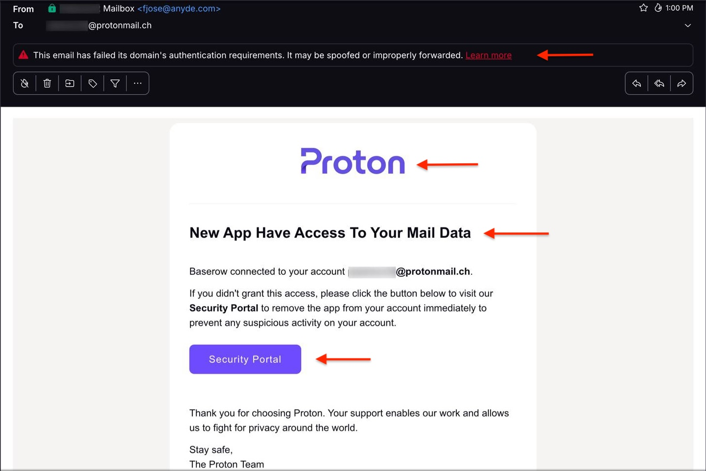
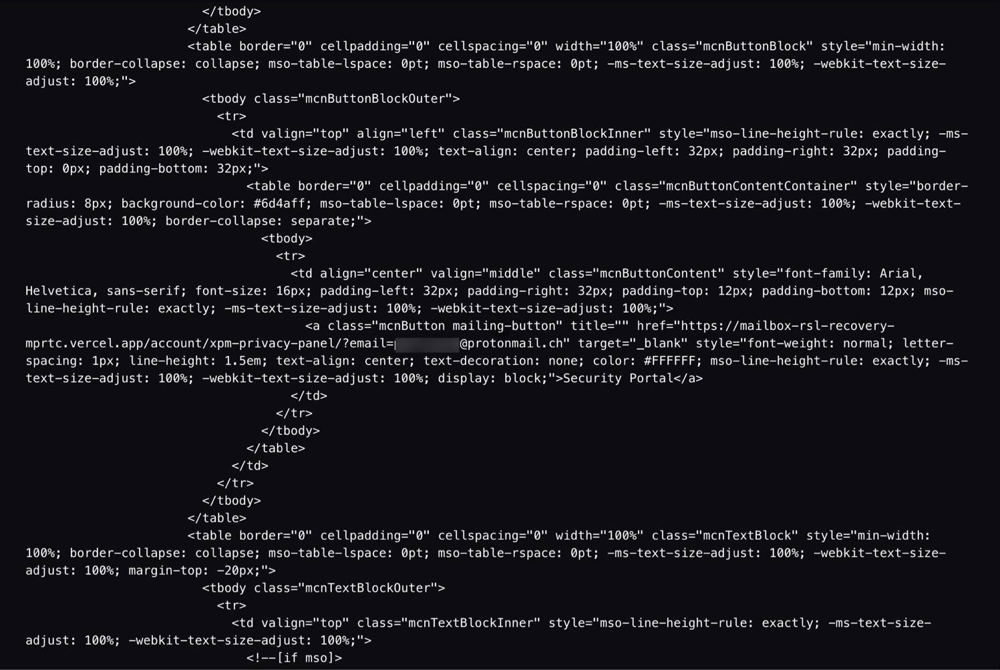

# Analyse de Phishing — Usurpation de la Marque Proton

> Premier incident détecté dans une série d'attaques contre **Buttercup Games** — analyse d'un email de phishing usurpant la marque **Proton for Business**.

---

## 📚 Table des matières

* [1. Contexte](#1-contexte)
* [2. Observation initiale](#2-observation-initiale)
* [3. Analyse du contenu de l'email](#3-analyse-du-contenu-de-lemail)
* [4. Analyse du lien malveillant](#4-analyse-du-lien-malveillant)
* [5. Analyse des en-têtes de l'email](#5-analyse-des-en-têtes-de-lemail)
* [6. SPF / DKIM / DMARC expliqués](#6-spf--dkim--dmarc-expliqués)
* [7. Chemin d'infrastructure](#7-chemin-dinfrastructure)
* [8. Indicateurs de Compromission (IOC)](#8-indicateurs-de-compromission-ioc)
* [9. Verdict SOC](#9-verdict-soc)
* [10. Réponse opérationnelle SOC](#10-réponse-opérationnelle-soc)

---

## 1. Contexte

Un employé de **Buttercup Games**, basé à Genève, signale un email suspect reçu dans sa boîte Proton. L'attaquant, ayant eu connaissance que la société utilise la plateforme ProtonMail for business, a usurpé son identité pour tenter de voler les credentials d'un employé.

La tentative échoue — l'employé ne clique pas sur le lien. L'email est transmis au SOC pour analyse.

Cet incident est le **point de départ d'une série d'attaques** contre Buttercup Games. Le même acteur malveillant sera retrouvé dans les investigations suivantes.

Le message affirme :

> *"Une nouvelle application a accès à vos données de messagerie"*

Le destinataire est invité à cliquer sur un bouton intitulé :

```
Security Portal
```

Cependant, Proton affiche immédiatement une alerte :

> **Cet email n'a pas satisfait aux exigences d'authentification de son domaine.**

Cela signifie que l'**authentification du domaine expéditeur échoue** — un signal d'alerte évident.

---

## 2. Observation initiale

À l'ouverture de l'email, plusieurs éléments attirent immédiatement l'attention.



### Signaux visibles

| Signal | Détail |
| --- | --- |
| Identité visuelle Proton copiée | Logo et mise en page imités |
| Fausse alerte de sécurité | "Une nouvelle application a accès à vos données" |
| Bouton d'action unique | "Security Portal" — crée un sentiment d'urgence |
| Avertissement d'authentification Proton | Affiché en haut de l'email |

> Il s'agit d'une technique de phishing classique : **créer un sentiment d'urgence autour de la sécurité du compte** pour pousser la victime à agir sans réfléchir.

---

## 3. Analyse du contenu de l'email

L'email contient :

* Le logo Proton
* Un message d'avertissement de sécurité
* Un bouton d'action "Security Portal"

**Objet du message :**

```
New App Have Access To Your Mail Data
```

### Signaux d'alerte

#### ❌ Erreur grammaticale

L'objet contient une faute de grammaire (*"Have"* au lieu de *"Has"*).  
Les emails officiels de Proton sont systématiquement relus avant envoi.

#### ❌ Aucun détail technique

Un vrai email de sécurité de Proton inclurait :

* L'heure de connexion
* Le nom de l'appareil
* La localisation
* Le nom de l'application concernée

**Aucun de ces éléments n'est présent.**

#### ❌ Appel à l'action unique

L'utilisateur est poussé à cliquer immédiatement.  
C'est une **caractéristique typique du phishing**.

---

## 4. Analyse du lien malveillant

En inspectant le code source HTML du bouton :



```
<a href="https://mailbox-rsl-recovery-mprtc.vercel.app/account/xpm-privacy-panel/?email=...">
  Security Portal
</a>
```

Le lien pointe vers :

```
vercel.app
```

> ⚠️ **Proton n'utilise pas ce domaine.** Il s'agit d'une plateforme externe utilisée pour héberger des pages frauduleuses.

### Interprétation sécurité

Le lien redirige très probablement vers :

* Une fausse page de connexion
* Un portail de phishing
* Un site de collecte d'identifiants

Il s'agit d'un **indicateur de compromission critique**.

---

## 5. Analyse des en-têtes de l'email

Les en-têtes d'un email permettent d'identifier l'**origine réelle** d'un message, indépendamment de ce qui est affiché au destinataire.


Champs clés :

```
From:        Mailbox <fjose@anyde.com>
Return-Path: <fjose@anyde.com>
```

Le message **prétend** provenir de `anyde.com`.  
Mais les vérifications d'authentification racontent une autre histoire.

---

## 6. SPF / DKIM / DMARC expliqués

Ces trois protocoles servent à vérifier l'authenticité de l'expéditeur d'un email.

### SPF (Sender Policy Framework)

**Résultat observé :**

```
spf=fail
```

Le SPF vérifie si le serveur qui a envoyé l'email est **autorisé à envoyer au nom du domaine**.

> Ici, le serveur expéditeur **n'est pas listé** dans l'enregistrement SPF de `anyde.com`. Le domaine ne l'a pas autorisé.

---

### DMARC (Domain-based Message Authentication)

**Résultat observé :**

```
dmarc=fail
```

Le DMARC vérifie l'**alignement** entre l'adresse expéditeur visible et les résultats d'authentification réels.

> Un échec DMARC signifie que l'identité de l'expéditeur est **probablement usurpée**.

---

### DKIM (DomainKeys Identified Mail)

**Résultat observé :**

```
dkim=pass header.d=bttlazer.org
```

Le message est **signé**, mais par `bttlazer.org` — et non par `anyde.com`.

> Cela signifie :
>
> * ✅ L'email possède une signature DKIM valide
> * ❌ Mais il est signé par **un domaine contrôlé par l'attaquant**, et non par l'expéditeur légitime

C'est une distinction subtile mais importante — un DKIM pass seul ne **signifie pas** que l'email est légitime.

---

## 7. Chemin d'infrastructure

Les en-têtes `Received` montrent le **trajet réel** de l'email à travers les serveurs.

```
Received: from [47.41.36.219] (helo=mail.bttlazer.org)
  by ironfist.servidorpt.pt
```

Puis :

```
Received: from ironfist.servidorpt.pt
  by protonmail.ch
```

### Flux simplifié

```
Hôte attaquant [47.41.36.219]
         ↓
   mail.bttlazer.org
         ↓
  ironfist.servidorpt.pt
         ↓
       Proton
```

> ⚠️ Aucun de ces serveurs n'appartient à l'infrastructure officielle de Proton.

---

## 8. Indicateurs de Compromission (IOC)

### Domaines

```
anyde.com
bttlazer.org
mail.bttlazer.org
ironfist.servidorpt.pt
mailbox-rsl-recovery-mprtc.vercel.app
```

### Adresses IP

```
47.41.36.219
185.32.188.7
```

### Résultats d'authentification

```
SPF:   fail
DMARC: fail
DKIM:  pass (mais signé par le domaine de l'attaquant : bttlazer.org)
```

### Techniques d'attaque

```
Usurpation de marque (Brand Impersonation)
Phishing de credentials
```

---

## 9. Verdict SOC

> 🔴 **Cet email est une tentative de phishing par usurpation de la marque Proton.**

| Indicateur | Constat |
| --- | --- |
| Domaine expéditeur | `anyde.com` — pas Proton |
| SPF | ❌ Échec |
| DMARC | ❌ Échec |
| DKIM | ⚠️ Pass, mais signé par `bttlazer.org` (domaine attaquant) |
| Destination du lien | `vercel.app` — pas Proton |
| Score spam | 101 (signalé comme spam) |
| Alerte Proton | Avertissement d'échec d'authentification affiché |

**Objectif probable :**

> Voler les identifiants Proton de la victime via une fausse page de connexion.

---

## 10. Réponse opérationnelle SOC

Dans un environnement d'entreprise, voici comment une équipe SOC répondrait :

### 📥 Collecte

* Sauvegarder l'email brut au format `.eml`
* Exporter les en-têtes complets du message

### 🔍 Extraction des IOC

* Extraire tous les domaines, adresses IP et URLs
* Soumettre les IOC aux plateformes de threat intelligence (VirusTotal, AbuseIPDB, etc.)

### 🚧 Confinement

* Bloquer les domaines au niveau de la passerelle email
* Bloquer les IPs au niveau du pare-feu
* Mettre à jour les règles de filtrage email

### 🚨 Si un utilisateur a cliqué sur le lien

* Forcer la réinitialisation du mot de passe
* Révoquer toutes les sessions actives
* Activer ou renforcer le MFA
* Analyser les journaux d'authentification pour détecter toute activité suspecte

